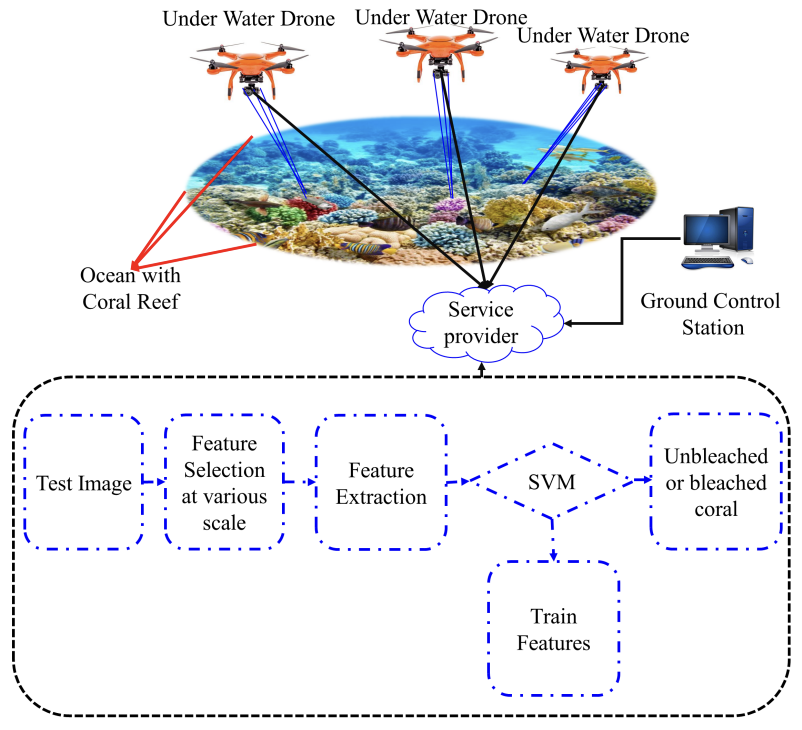

🌊 **Dive Deep into Coral Analysis with CNN!** 🌊

🚀 Basic Idea in Article! 🚀

    

**🔬 Overview and Background**

Embark on a groundbreaking journey with our project, a beacon of hope in the conservation efforts for our precious coral reefs. Stemming from our recent publication in the MDPI Big Data and Cognitive Computing journal, this initiative stands at the forefront of marine biology and artificial intelligence.

📖 In our published work [1], we introduced a novel dataset, crafted with meticulous attention, aimed at deciphering the mysteries of coral health. This project transcends our initial work by introducing an innovative Convolutional Neural Network (CNN) model, tailored to classify corals as bleached, healthy, or dead, marking a significant leap from our MATLAB roots.

🔗 **Key Reference:**
- [1] S. Jamil, M. Rahman, and A. Haider, "Bag of Features (BoF) Based Deep Learning Framework for Bleached Corals Detection," in *Big Data Cogn. Comput.*, 2021, vol. 5, no. 53. Dive into the details [here](https://doi.org/10.3390/bdcc5040053).

🌐 **Dataset Availability**
- The cornerstone of our project, the meticulously curated dataset, is accessible to all visionaries keen on making a difference. Explore and utilize this treasure trove available on Kaggle [2].
  - [Access the Dataset](https://www.kaggle.com/sonainjamil/bhd-corals)

**🛠 How This Project Stands Out**

Transitioning from MATLAB to a fresh CNN model, this project is not just a leap in technology but a stride towards safeguarding our marine biodiversity. With each line of code, we move closer to understanding the silent cries of our underwater forests, enabling us to act decisively in their preservation.

**🌟 Join Us in This Noble Cause**

We invite you to delve into this project, where technology meets marine conservation. Together, let's unlock the secrets of the deep and contribute to a future where corals thrive in vibrant, healthy reefs.

